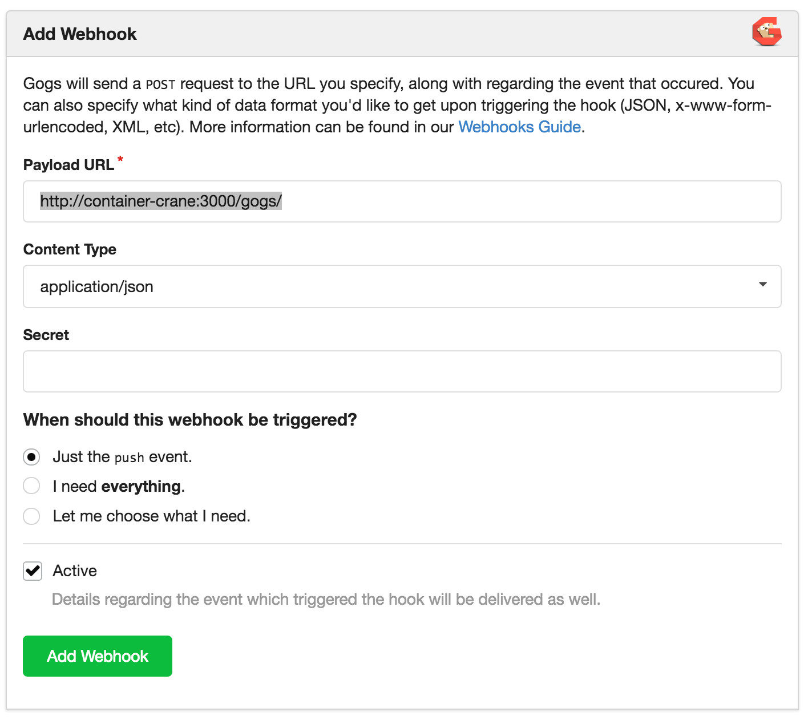

# container-crane
> Listen for webhooks and execute a deployment script

By [v-braun - www.dev-things.net](http://www.dev-things.net).


## Description
[Express](http://expressjs.com/) based HTTP Endpoint that listens to webhooks. Downloads a file named **deploy.crane** from the repository and executes it.

I use it with [Gogs](https://gogs.io/) to deploy my Docker container to a production environment.

## Installation

### Standalone installation
Install it globally:

```bash
npm install container-crane -g
```

and then start it:

```bash
container-crane
```

### As a Docker container
```bash
# (optional )Create a network for Gogs and container-crane (not port mappings required)
docker network create deployment-net

# Pull image from Docker Hub.
docker pull devthings/container-crane

# Use `docker run` for the first time.
# map the docker.sock from host within the container
# if you want to use docker commands in your deploy scripts 
# (to deploy "neighbor" containers).
docker run --name="container-crane" --net="deployment-net" --restart=always -d -v /var/run/docker.sock:/var/run/docker.sock -v $(which docker):/bin/docker devthings/container-crane

# Use `docker start` if you have stopped it.
docker start container-crane

# (optional) Restart your Gogs container within the deployment-net network
# docker run --name="gogs" --net=deployment-net // other params

```

## Usage

Setup a webhook in your Gogs repository that points to the */gogs/* endpoint of the **container-crane** container:



Now you need a deployment script for your app.
You can write it in bash or node (both is installed on the container-crane Docker image)

Create a file named **deploy.crane** within your repository.

Here is an example as a bash script:

```bash
#! /bin/bash
echo "stop the container"
docker stop my-app
echo "remove container"
docker rm my-app
echo "build image"
docker build -t my-app --force-rm=true http://gogs:3000/my-gogs-user/my-app.git
echo "run the container"
docker run --name=my-app --restart=always -d -p 3000:3000 my-app
```

> NOTE: container-crane depends not on docker! 
> The deploy.crane script depends on your hosting environment.

Now you can simply:

```bash
git push your-gogs-origin
```


After container-crane receive a POST request from Gogs, it parses the webhook request body and downloads a script named **deploy.crane**.
When the file is downloaded it will be executed.


## FEATURES
- [x] Installation as container from Docker Hub
- [x] Handle secret from Gogs request
- [ ] Support other endpoints:
	- GitHub
	- Slack

## Tests
To execute tests run:

```bash
npm test
```

To execute tests with watch run:

```bash
npm run dev
```


### Known Issues

If you discover any bugs, feel free to create an issue on GitHub fork and
send me a pull request.

[Issues List](https://github.com/v-braun/container-crane/issues).

## Authors

  
[v-braun](https://github.com/v-braun/)


## Contributing

1. Fork it
2. Create your feature branch (`git checkout -b my-new-feature`)
3. Commit your changes (`git commit -am 'Add some feature'`)
4. Push to the branch (`git push origin my-new-feature`)
5. Create new Pull Request


## License

See [LICENSE](https://github.com/v-braun/container-crane/blob/master/LICENSE).
